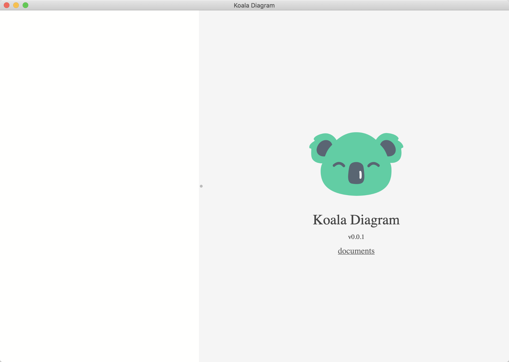

# Koala Diagram

**A diagram tool for programmers powered by [mermaid](https://github.com/mermaid-js/mermaid).**


This is a diagram tool based on the [mermaid](https://github.com/mermaid-js/mermaid) library, and [Electron](https://www.electronjs.org/) cross platform desktop apps framework.

## Screenshot




## Binary Download

Download binaries from [release page](https://github.com/xyeric/koala-diagram/releases).

## Custom Build

for Chinese:
```shell
export ELECTRON_MIRROR="https://npm.taobao.org/mirrors/electron/"
export ELECTRON_CUSTOM_DIR="7.1.11"

npm --registry=https://registry.npm.taobao.org install

npm run build:darwin
```

for Others:
```shell
npm install

npm run build:darwin
```

after build success, the executable is put into `build` directory.

## Contribution

Any contributions are welcome.
