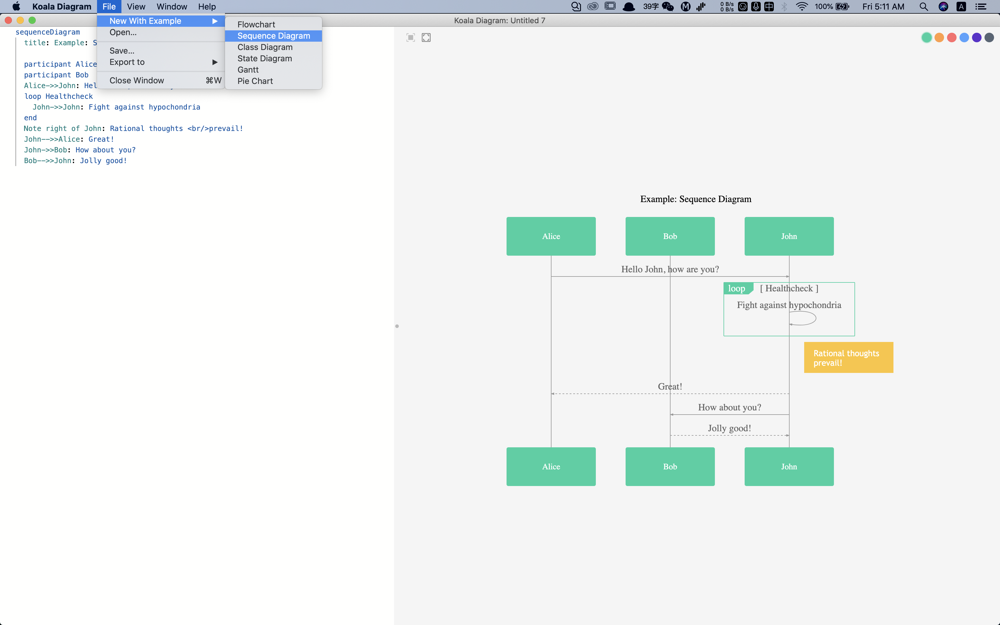
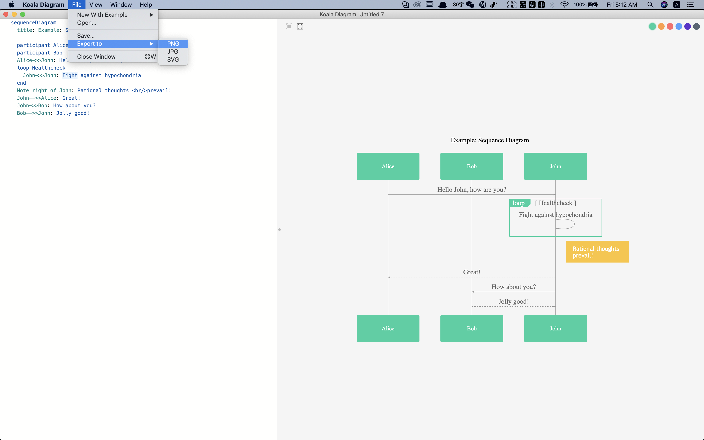

# Koala Diagram

**A diagram tool for programmers.**

## Usage

### Create Diagram

click 'File->New With Example', then select a diagram type.

### Save Diagram

click 'File->Save...', input file name and click the 'ok' button.

### Export Image

click 'File->Export to', select a image type.

## Code Syntax

Koala Diagram is based on `Mermaid` library, and only support mermaid syntax.

For more information, please visit: https://mermaid-js.github.io/mermaid/#/sequenceDiagram